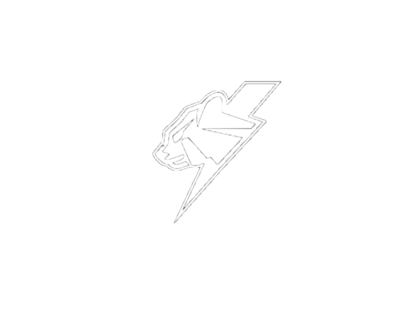

# LazyPuma
## Projeto de PTI/PTR + PGP / MERN STACK

  

## Descrição do Projeto

LazyPuma é um site de E-commerce desenvolvido como parte do projeto de PTI/PTR + PGP, utilizando a MERN Stack (MongoDB, Express.js, React e Node.js). O objetivo deste projeto é fornecer uma plataforma para gerenciamento de encomendas, criação de produtos e venda de produtos online.

## Recursos Principais
- Registo de utilizadores com autenticação e autorização
- Página de perfil para cada usuário
- Adição, edição e remoção de produtos
- Carrinho de compras
- Checkout e processamento de pagamento
- Histórico de pedidos e de vendas
- Pesquisa de produtos
- Integração com API de envio

## Tecnologias Utilizadas
- MongoDB: Base de dados NoSQL para armazenamento de informações do site
- Express.js: Framework Node.js para construção de aplicações web
- React: Biblioteca JavaScript para construção de interfaces de utilizadores interativas
- Node.js: Ambiente de execução JavaScript do lado do servidor
- Bootstrap: Framework CSS para criação de designs responsivos

## Contribuidores

- Diogo Gil
- Francisco Pinto
- Gabriel Azevedo
- Lara Ângelo
- Maria Jerónimo
- Tiago Rosa
